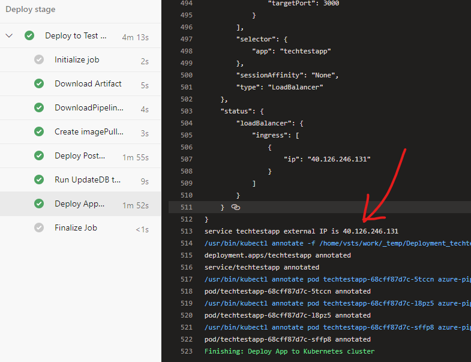

# Tech Test Solution

## Overview

This is a simple GTD Golang application that is backed by a Postgres database.

## Architecture

The application is packaged as a Docker image to Azure Container Registry and deployed to an Azure Kubernetes Service using Azure DevOps pipeline.

The initial plan is to manage Azure resource infrastructure and resource configuration through ARM templates, manage Kubernetes configuration through Kubernetes manifest templates and manage deployments through Azure pipeline yml templates.

Caveats - Some features of Azure Kubernetes Service are in public 'preview' state, some features are not supported in the Australia region (yet), and some features are only available on 'Premium' SKU of ACS and AKS at increased cost. 

By default Azure Kubernetes Service uses a VM Availability Set to spread the Kubernetes nodes across 2 fault domains and 3 update domains in the selected Azure region making the solution reasonably robust within one Azure data center.

Use of Kubernetes behaviour specification means the application can be automatically scaled up and down across mulitple pods.

The initial deployment will host the application in a 'test' namespace on a 3 replica pod across 2 nodes in a single node pool using 'Standard B2s' size VMs. After validation of the solution architecture and discussion of known limitations, the cluster may be recreated on a Standard SKU supporting multiple node pools better optimized for data IOPS and compute.

An Azure DevOps pipeline is used to automatically build the image and deploy to Kubernetes. The Azure pipelines use pre-defined service connections to ACS and AKS, and the deployment steps dynamically use the connections to authenticate without exposing ACS or AKS access keys.

The Azure DevOps project service connection authentications are isolated to the project and not shared with other projects in the organisation.

A pipeline environment is used to monitor and trace deployment history to the cluster includng the linked commit history. The initial deployment uses one 'test' pipeline environment. Additional staging / production environments should be added after discussing non functional requirements and dev / test / release management strategies with the development team.

I have stopped making further changes to the solution that could make the initial deployment more complex or over engineered. The existing documentation and architecture notes imply the initial solution should be reasonably simplified without making the solution bigger than necessary.

The next sections describe some of the architecture decisions in this solution design.


### Kubernetes vs Azure App Service and Azure Postgres Database

Given the source repo already contains a `Dockerfile`, and existing documentation contains references that this solution was designed to be containerized, the deployment uses Docker and Kubernetes. Teams are far more likely to be highly effective when using tools and services they are already familiar with.

However if the team does not currently have experience maintaining Docker and Kubernetes I would lean towards using Azure App Service and Azure Database. If a development team has a desire to keep a simplified architecture I would further recommend using managed cloud services so that the development team can focus on building the app, and leave the infrastructure management to the PaaS service providers. 

Regardless, there are several pros and cons which should still be discussed with the development team.

- Security Governance: Compare use of integrated AAD and Managed Identity credentials and Kubernetes secrets.
- Performance: Consider managed services are built on highly optimised IOPS and compute specifically designed for each service.
- Scalability: Kubernetes and PaaS are both HA and scalable but are managed differently and have some different constraints described below. 

This blog is a good starting point for team discussion 
(https://www.codersbistro.com/blog/aks-service-fabric-and-app-service-compared/)

I have selected Azure Kubernetes Service for the initial deployment.

### Azure Pipelines vs CircleCI 

The original source project contains a .circleci config to build and package the app files in zip format and tag a github release.

However I dont have access to the CircleCI account so I selected Azure Pipelines to create an automated deployment. 

Ideally I would collaborate with the development team to extend the existing CircleCI pipeline to package the app to a container registry and deploy to a kubenetes service. This would hopefully improve effectiveness by using existing knowledge the team already has, without increasing complexity by adding another tool.

There are potential differences in CI / CD feature capabilities that should be reviewed, and some have been listed under known issues below.

I have selected Azure Pipelines for the intial automated deployment, but this needs urgent evaluation with the team before expanding further given the existing use of Circle CI.

## Known Issues

The original solution does not contain any automated tests. Automated deployments will result in untested potentially buggy code being pushed to a production environment. A basic end to end deployment test has been added in order to test the health check, and test seed data appears in the application. Test strategy and approach needs to be discussed with the development team before progressing further.

The Azure Kubernetes Service extension 'Local Process' (previously known as Dev Spaces) allows a remote process debugging experience as if running a local Kubernetes instance. The local process feature is currently in public preview and has not been configured for the solution yet. Developer and Tester experience should be discussed with the team.
https://code.visualstudio.com/docs/containers/local-process-kubernetes
https://docs.microsoft.com/en-us/azure/dev-spaces/

The AKS Deployment Center feature and AKS Policies feature are also in public preview and have not been configured. While the wider Azure Policies are a GA service,the AKS Policies feature is still in preview and requires signing up with Microsoft to register for the preview.

The current Kubernetes persistent volume uses Azure Disks and postgres is thus restricted to a single postgres pod. The alternative Azure Files volumes support the Kubernetes ReadWriteMany access mode however further work is needed to workaround the [postgres permission setup issue](/manifests/readme.md#AKSStorageVolumes) with Azure Files. 

Further, the use of AKS node pools to span multiple Availability Zones will make the solution highly available in event of an entire Azure region being unavailable. However *AKS Availability Zones are not yet supported in Australia region*. The existing solution is only robust with a single Azure zone. Alternatives are to consider hosting in the Southeast Asia or Japan East regions.

Azure Monitor Insights, Azure Alerts and Azure Log Analytics have not been configured yet. These require a Log Analytics workspace and can easily be added later after validation of the solution architecture.

Use of Azure DevOps pipline creates a little dependency issue - the Azure DevOps project service connections to ACS and AKS need to manually configured before the Azure pipeline is run for the first time. A separate pipeline, ARM template or other tool is recommended to initially create the ACS and AKS resources after the solution architecture has been validated, however the project service connections still require manual configuration, and the Container Registry variable in the pipeline yml may need to be modified as the ACR name must be globally unique.

The current Azure pipeline only has one deploy stage to a test environment and needs to be extended to promote the image to a production environment once tested and approved. The dev / test strategy need discussion with the team. 

## To Do

- Recreate ACS with Premium SKU (at increased cost) and update ARM template to modify ACS network configuration to deny public access and create private end points.
- Consider replacing Azure Devops service connections to ACS and AKS with custom Managed Identities with Azure role based access.
- Set up AKS in a Standard or Premium SKU and update ARM template to add network firewall rules.
- Replace use of default postgres user/password and store the password either as a Kubernetes secret or Azure Keyvault.
- Consider AKS HA availability in other regions to use multiple node pools https://docs.microsoft.com/en-us/azure/aks/availability-zones
- Add the automated test to the pipeline by passing the public IP as an environment variable to a PowerShell task.
- Consider moving Azure Container Registry and Log Analytics to a shared resource group with other applications to reduce costs.
- Add Application Insights or other monitoring tools for deeper understanding of the internal web app performance and user experience.

## Documentation

### Kubernetes Manifests

Kubernetes manifests are located in the `/manifests/` directory.

See the [manifests readme.md](/manifests/readme.md) for more information.

### Azure DevOps Pipeline

The Azure pipeline is currently defined in a single `/azure-pipelnes.yml` file.

See the [Azure Pipeline readme azure-pipelines.md](azure-pipelines.md) for more information.

## Getting Started

Follow the steps below to get the solution deployed to a clean Azure subscription using a clean Azure Devops project.

### Requirements

Azure Account with access to create resource groups and AAD service principals.
Azure DevOps Account with access to create a project and service connections.
PowerShell Core with Az module installed to run setup scripts and run a deployment test. 

### Azure Setup

For production the standard or premium skus should be used which support network firewall rules and additional scaling options. 

For the purpose of the initial deployment on a personal subscription, a basic container registry and a Kubernetes pool with 2 small VMs is created.

Quick start without existing Azure service principal (one is automatically generated).

``` PowerShell
Connect-AzAccount
$rgName = 'TechTest'
New-AzResourceGroup -Name $rgName -Location 'Australia East'
$acr = New-AzContainerRegistry -ResourceGroupName $rgName -Name "acr$rgName" -Sku Basic
$aks = New-AzAks -ResourceGroupName $rgName -Name "aks$rgname" -NodeVMSize Standard_B2s -NodeCount 2
```

Alternatively an Azure Resource Management ARM template can be used to consistently deploy ACS and AKS (if service principal has already been created). 

An ARM template has been created but the multi-step process to create the AAD app registration, service principal, Key Vault, and then populate secrets in to the vault has not been automated in this solution yet.

While creating a service principal can be [automated with a self-signed certificate](https://docs.microsoft.com/en-us/azure/active-directory/develop/howto-authenticate-service-principal-powershell) it is usually performed by [creating a service principal using Azure portal](https://docs.microsoft.com/en-us/azure/active-directory/develop/howto-create-service-principal-portal#register-an-application-with-azure-ad-and-create-a-service-principal).

The service principal secret (and optionally Id) should be placed in an Azure KeyVault so they can be referenced by other Azure services without exposing secret values. 

The below PowerShell will apply the ARM template and prompt for the service principal id and secret.

Use -WhatIf parameter on the deployment command to check what resources will be added or modified (behaves similar to a Terraform plan command).

``` PowerShell
Connect-AzAccount
$rgName = 'TechTest'
New-AzResourceGroup -Name $rgName -Location 'Australia East'
$params = @{
    ResourceGroupName = $rgName
    AzureContainerRegistryName = 'acrtechtest'
    AzureKubernetesServiceName = 'akstechtest'
    LogAnalyticsName = 'logstechtest'
}
New-AzResourceGroupDeployment @params -TemplateFile azure-arm.json -WhatIf
```

Repeat the last command without -WhatIf to apply the deployment.

> Note: The name of the Container Registry must be globally unique and if a different name is used the Container Registry variable in the azure-pipeline.yml must be updated to match the server name in the steps below e.g. 'acrtechtest.azurecr.io'.

### Azure DevOps Project Setup

Login to Azure Devops `https://dev.azure.com/<myaccount>`.

Create a new Azure DevOps project using the '+ New Project' button top right of screen. Accept the default values for Git version control and Work Item process.

Go to Pipelines > Environments.

Create a new environment named 'TechTest-test' (this will be the test environment rather than -prod environment) and select the Kubernetes resource.

Select your 'aksTechTest' resource created above and create a new namespace called 'test'. Click 'Validate and create'.

This creates an Azure DevOps environment, adds the Kubernetes namespace that can be isolated from the production nodes in future, and creates a project level service connection to the Kubernetes namespace.

Go to project settings `https://dev.azure.com/<myaccount>/<myproject>/_settings/`.

Select 'Service connections' under the 'Pipelines' heading.

The Kubernetes service connection to the namespace is displayed. Edit this service connection and change the service connection name to `AKSTechTest-test`.

> Note: The service connection names in the azure-pipelines.yml need to match the service connection names for your project.

Create a new service connection, selecting the 'Docker Registry' type and click 'Next'. 

Set the Registry Type = 'Azure Container Registry' and select your 'acrTechTest' resource created above.

Name this service connection 'ACRTechTest' and Save the connection.

The final step is to setup an Azure pipeline to use these service connections to build and deploy the container images.

### Azure Pipeline Setup

Check the azure-pipelines.yml variables match the names of the service connections created above, including the name of your ACS server e.g. `acrtechtest.azurecr.io`.

Go to the Azure DevOps build pipelines page `https://dev.azure.com/<myaccount>/<myproject>/_build`.

Create a pipeline, and select this GitHub repo. 

Save and run the pipeline. This will trigger a build and deployment to the Kubernetes namespace.

The initial deployment will take around 3 minutes and the cluster external IP is shown in at the bottom of the deploy log.



## Tests

After a successful deployment, use PowerShell Core to run some basic deployment tests.

Install PowerShell Core and `Install-Module -Name Pester -Scope CurrentUser`.

Edit `e2e.tests.ps1` and set the $apphost variable to the external IP.

Run `Invoke-Pester -Output Detailed` or run the tests in `/e2e.tests.ps1` using VS Code. 

Expected output:

```
Describing TestTechApp with database seed data
  [+] healthcheck should be 'OK' 33ms
  [+] API get task should return seed data 15ms
```

## Next Steps

- Describe architecture considerations
  - Currently one Azure Devops environment, need discussion with team about use of dev/test environments
- Describe security considerations
  - Postgres is still using the default username and pwd
  - Network firewall and access not configured yet (using basic not standard AKS sku)
- Describe monitoring considerations
  - Currently only out-of-the-box basic monitoring. Log Analytics is included in the ARM template but configuration with AKS, and monitor alerts have not been configured.
- Describe performance considerations
  - Currently defaults to single node with one pod, scale properties not configured.
